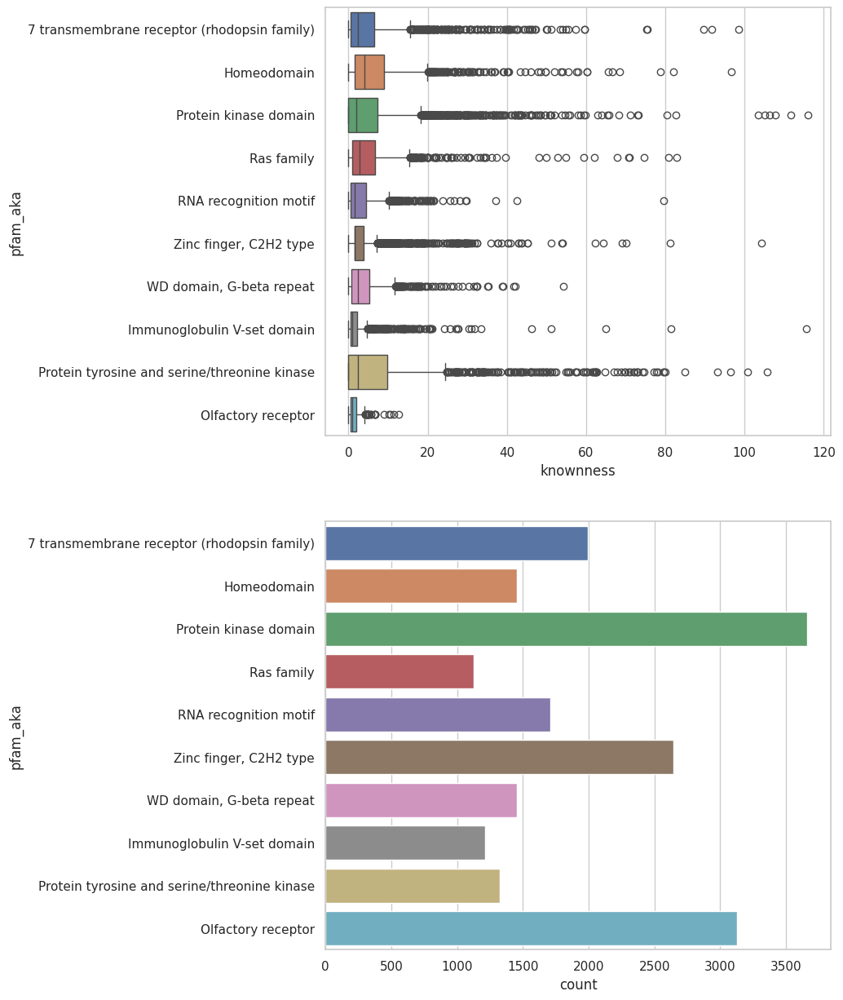

# Exploración

## Metodología

### 1. Exploración de la Base de Datos
Se comenzó explorando la base de datos utilizando tanto Pandas como SQL. Se realizaron consultas SQL para obtener una visión general de los diferentes atributos presentes en la base de datos y para realizar recuentos de parámetros relevantes, como el grado de conocimiento y las especies presentes.

Este análisis se puede ver en el archivo [exploracion.ipynb](https://github.com/justog220/ABP-EB/blob/main/Exploracion/exploracion.ipynb).

### 2. Análisis de PFAM
Se realizó un análisis específico de los identificadores PFAM presentes en la base de datos. Para esto, se implementaron funciones para realizar scraping en la base de datos de InterPro [[7]](#ref-7) con el fin de obtener los nombres cotidianos asociados a los identificadores PFAM. Posteriormente, se exploró la distribución de familias de proteínas en la base de datos utilizando esta información.

Como se puede observar en la imágen anterior, la segunda familia más presente es la de los receptores olfatorios. Este dato llamó nuestra atención por los procesos en los que están involucrados, potenciales aplicaciones con ellos y porque era un número suficientemente elevado como para llevar a cabo distintos análisis.

## Referencias
[1.][ref-1] Bioinformatics With BB (Director). (2020, julio 30). Molecular Docking  | Autodock VINA Virtual Screening  | VINA Docking tutorial | Bioinformatics. https://www.youtube.com/watch?v=tFFxNTvvoJI

[2.][ref-2] Eberhardt, J., Santos-Martins, D., Tillack, A. F., & Forli, S. (2021). AutoDock Vina 1.2.0: New Docking Methods, Expanded Force Field, and Python Bindings. Journal of Chemical Information and Modeling, 61(8), 3891-3898. https://doi.org/10.1021/acs.jcim.1c00203

[3.][ref-3] Harini, K., & Sowdhamini, R. (2015). Computational Approaches for Decoding Select Odorant-Olfactory Receptor Interactions Using Mini-Virtual Screening. PLOS ONE, 10(7), e0131077. https://doi.org/10.1371/journal.pone.0131077

[4.][ref-4] Menardo, F., Loiseau, C., Brites, D., Coscolla, M., Gygli, S. M., Rutaihwa, L. K., Trauner, A., Beisel, C., Borrell, S., & Gagneux, S. (2018). Treemmer: A tool to reduce large phylogenetic datasets with minimal loss of diversity. BMC Bioinformatics, 19(1), 164. https://doi.org/10.1186/s12859-018-2164-8

[5.][ref-5] Morris, G. M., Huey, R., Lindstrom, W., Sanner, M. F., Belew, R. K., Goodsell, D. S., & Olson, A. J. (2009). AutoDock4 and AutoDockTools4: Automated Docking with Selective Receptor Flexibility. Journal of computational chemistry, 30(16), 2785-2791. https://doi.org/10.1002/jcc.21256

[6.][ref-6] O’Boyle, N. M., Banck, M., James, C. A., Morley, C., Vandermeersch, T., & Hutchison, G. R. (2011). Open Babel: An open chemical toolbox. Journal of Cheminformatics, 3(1), 33. https://doi.org/10.1186/1758-2946-3-33

[7.][ref-7] Paysan-Lafosse, T., Blum, M., Chuguransky, S., Grego, T., Pinto, B. L., Salazar, G. A., Bileschi, M. L., Bork, P., Bridge, A., Colwell, L., Gough, J., Haft, D. H., Letunić, I., Marchler-Bauer, A., Mi, H., Natale, D. A., Orengo, C. A., Pandurangan, A. P., Rivoire, C., … Bateman, A. (2023). InterPro in 2022. Nucleic Acids Research, 51(D1), D418-D427. https://doi.org/10.1093/nar/gkac993

[8.][ref-8] Price, M. N., Dehal, P. S., & Arkin, A. P. (2010). FastTree 2 – Approximately Maximum-Likelihood Trees for Large Alignments. PLOS ONE, 5(3), e9490. https://doi.org/10.1371/journal.pone.0009490

[9.][ref-9] Rocha, J. J., Jayaram, S. A., Stevens, T. J., Muschalik, N., Shah, R. D., Emran, S., Robles, C., Freeman, M., & Munro, S. (2023). Functional unknomics: Systematic screening of conserved genes of unknown function. PLOS Biology, 21(8), e3002222. https://doi.org/10.1371/journal.pbio.3002222

[10.][ref-10] Sievers, F., Wilm, A., Dineen, D., Gibson, T. J., Karplus, K., Li, W., Lopez, R., McWilliam, H., Remmert, M., Söding, J., Thompson, J. D., & Higgins, D. G. (2011). Fast, scalable generation of high-quality protein multiple sequence alignments using Clustal Omega. Molecular Systems Biology, 7, 539. https://doi.org/10.1038/msb.2011.75

[11.][ref-11] Varadi, M., Bertoni, D., Magana, P., Paramval, U., Pidruchna, I., Radhakrishnan, M., Tsenkov, M., Nair, S., Mirdita, M., Yeo, J., Kovalevskiy, O., Tunyasuvunakool, K., Laydon, A., Žídek, A., Tomlinson, H., Hariharan, D., Abrahamson, J., Green, T., Jumper, J., … Velankar, S. (2024). AlphaFold Protein Structure Database in 2024: Providing structure coverage for over 214 million protein sequences. Nucleic Acids Research, 52(D1), D368-D375. https://doi.org/10.1093/nar/gkad1011

[ref-1]: #ref-1
[ref-2]: #ref-2
[ref-3]: #ref-3
[ref-4]: #ref-4
[ref-5]: #ref-5
[ref-6]: #ref-6
[ref-7]: #ref-7
[ref-8]: #ref-8
[ref-9]: #ref-9
[ref-10]: #ref-10
[ref-11]: #ref-11