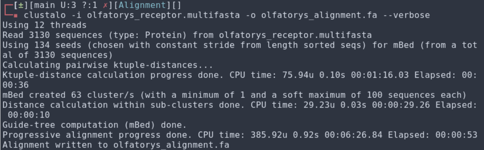

# Alignment

## Metodología

### 1. Generación del MultiFasta
Habiendonos familiarizado con el formato de archivo multifasta y partir del subset con los receptores olfatorios que habíamos generado con la información presente en la base de datos del Unknome, creamos un *olfatorys_receptor.multifasta* con la información de los headers y secuencia de cada uno de los receptores presentes en Unknome.

### 2. Alineamiento
Se llevó a cabo la instalación de [Clustal Omega](http://www.clustal.org/omega/), luego se llevo a cabo el alineamiento con esta herramienta con los parámetros por defecto.

Esto produjo como resultado el archivo *olfatorys_alignment.fa* con el alineamienot propiamente dicho.

### 3. Análisis
Qusimos hacer análisis de regiones conservadas con [WebLogo](https://weblogo.berkeley.edu/logo.cgi) pero por la cantidad de secuencias y los gaps introducidos, no pudimos extraer información relevante de ellos. Sin embargo, decidimos utilizar el alineamiento ya producido para [crear un árbol filogenético](https://github.com/justog220/ABP-EB/tree/main/OlfatoryReceptors/PhyTree).

## Referencias

