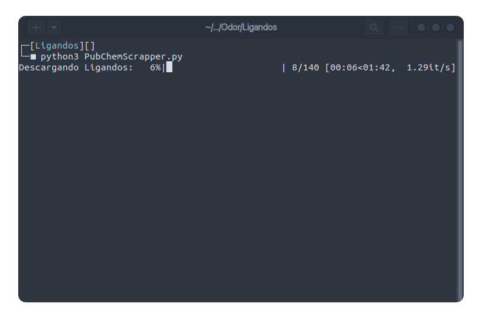
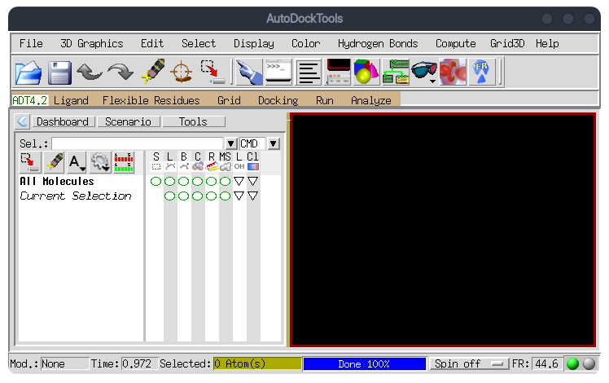
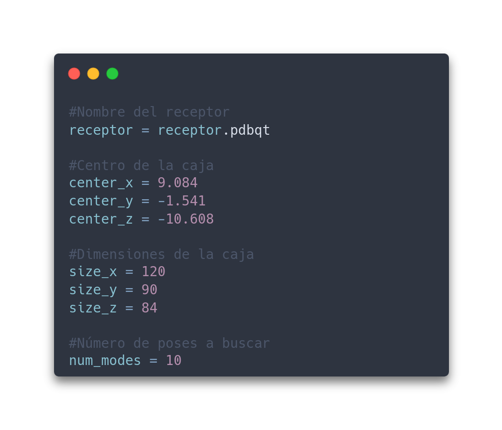
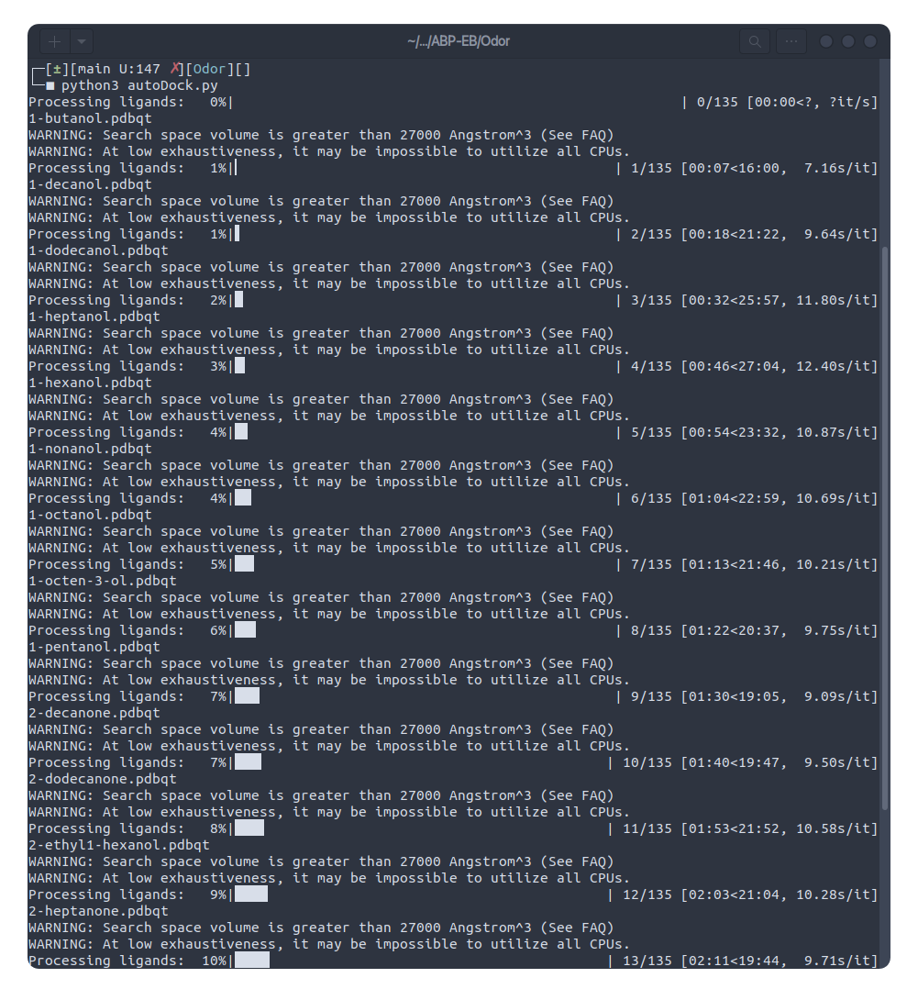
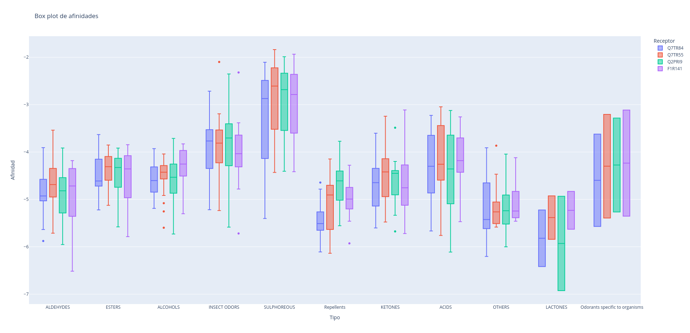

# Docking
## Descripción
Habiendo seleccionado cuatro receptores olfatorios presentes en el Unknome, a través del enfoque de reducción de dimensionalidad del árbol filogenético obtenido del alineamiento de ellos, realizamos un estudio de docking con diversos ligandos para investigar sus potenciales interacciones.

## Metodología
### 1. Selección de Receptores Olfatorios
La meotodología para la selección de los receptores olfatorios se desarrolla en [el README de la carpeta del nivel superior](https://github.com/justog220/ABP-EB/tree/main/OlfatoryReceptors).

### 2. Selección y Preparación de Ligandos
Tomamos como referencia los ligandos y la clasificación listada en el artículo:

Computational Approaches for Decoding Select Odorant-Olfactory Receptor Interactions Using Mini-Virtual Screening Harini K, Sowdhamini R (2015) Computational Approaches for Decoding Select Odorant-Olfactory Receptor Interactions Using Mini-Virtual Screening. PLOS ONE 10(7): e0131077. https://doi.org/10.1371/journal.pone.0131077

Estos presentan ligandos que corresponden a las siguientes clasificaciones:


|Grupo|
|:---:|
|Alcohol|
|Ácidos|
|Aldehídos|
|Cetonas|
|Ésteres|
|Sulfuros|
|Lactones|
|Otros|
|Odorantes de insectos|
|Odorantes específicos de especies|
|Repelentes|

En la carpeta *Ligandos/* desarrollamos tres scripts:
- *[preparacionCsv.py:](https://github.com/justog220/ABP-EB/blob/main/OlfatoryReceptors/Docking/Ligandos/preparacionCsv.py)* para convertir la información del artículo a un archivo .csv que permita su posterior manipulación con mayor facilidad.
- *[PubChemScraper.py:](https://github.com/justog220/ABP-EB/blob/main/OlfatoryReceptors/Docking/Ligandos/PubChemScrapper.py)* sript que declara funciones para bajar una estructura de la API de [PubChem](https://pubchem.ncbi.nlm.nih.gov/) en formato SDF 3D. Luego recorre el csv generado en el script anterior y guarda todas las estructuras en *PubChem/*


- *[sdfToPDBQT.py:](https://github.com/justog220/ABP-EB/blob/main/OlfatoryReceptors/Docking/Ligandos/sdfToPDBQT.py)* Script que implementa la utilización programáticamente de la herramienta [OpenBabel](https://openbabel.org/index.html) para convertir las estructuras de los ligandos de formato SDF 3D a PDBQT y agregarle los hidrógenos polares necesarios.

La ejecución de estos scripts da como resultado la generación de dos carpetas:
- *PubChem/:* Estructuras en formato SDF descargadas de PubChem. <!-- TODO: agregar link a carpeta -->
- *PDBQT/:* Estructuras en formato PDBQT generadas por OpenBabel. <!-- TODO: agregar link a carpeta -->

### 3. Preparación de Receptores
Los 4 receptores seleccionados fueron preparados para el docking. Esto incluyó la adición de hidrógenos, reconstrucción de átomos faltantes, la asignación de cargas parciales y la generación de archivos PDBQT adecuados para el docking. Para ello se hizo uso de la herramienta [AutoDockTools](https://autodocksuite.scripps.edu/adt/) [5], que forma parte del paquete [MGLTools](https://ccsb.scripps.edu/mgltools/).




### 4. Declaración de configuraciones
Para facilitar la automatización de los procesos se desarrolló la especificación de las configuraciones necesarias para cada receptor según lo esperado por AutoDock Vina. Estas se encuentran disponibles en la carpeta *configs/*. Un ejemplo se muestra a continuación:
<!-- TODO: agregar link a carpeta --> 




### 5. Ejecución del Docking
Desarrollamos scripts automatizados para ejecutar consecutivamente los estudios de docking de cada receptor de todos los ligandos utilizando [AutoDock Vina](https://vina.scripps.edu/) [2]. Para ello se utilizó como referencia [un video de YouTube](https://www.youtube.com/watch?v=tFFxNTvvoJI) que implementaba un algoritmo en Perl, se realizaron los cambios necesarios para poder realizarlo con Python y permitir que se realice para más de un receptor, dado que en la referencia se trabajaba con uno solo.


Para ello se desarrollaron un script principales:
- *[Vina.py:](https://github.com/justog220/ABP-EB/blob/main/OlfatoryReceptors/Docking/Vina.py)* Adaptación del script de perl del video. Permite que se pase como argumento el identificador del receptor a utilizar. Luego va realizando la ejecución de vina para cada uno de los ligandos con el receptor que se haya pasado, guardando los logs en un archivo .log en *Dockings/receptor/* y las poses de los ligandos en *out/receptor/* . Este proceso generó los logs con información sobre la afinidad de los ligandos para cada receptor en distintas poses, e información sobre estas poses.
- [*autoDock.py:*](https://github.com/justog220/ABP-EB/blob/main/OlfatoryReceptors/Docking/autoDock.py) Utiliza el script del inciso anterior para ir corriendo el docking de todos los ligandos para cada uno de los receptores seleccionados, estableciendo las configuraciones previamente establecidas para cada uno de ellos.

Este script lo ejecutamos como:
```bash
python3 autoDock.py
```



### 6. Procesamiento y Análisis de Resultados
Una vez completados los estudios de docking, procesamos los logs para extraer las afinidades de la mejor pose de cada ligando-receptor. Ademas, identificamos y etiquetamos los outliers, proporcionando una visión más clara de las interacciones más relevantes y significativas.

- *procesarLogs.py:* Analiza los logs generados por la ejecución del script anterior y generación de gráficas de boxplot diferenciando las afinidades por grupo e identificando los outliers.



## Resultados
Este estudio nos proporcionó un paso más hacia la dilucidación de las posibles funciones de los receptores olfatorios presentes en la base de datos de partida. Además nos permitió consolidar un flujo de trabajo que podría ser aplicable y generalizado con facilidad a nuevos receptores e incluso ligandos. La modularidad de scripts permite que se vayan modificando o utilizando segun las necesidades de los procesos.

## Referencias
[1.][ref-1] Bioinformatics With BB (Director). (2020, julio 30). Molecular Docking  | Autodock VINA Virtual Screening  | VINA Docking tutorial | Bioinformatics. https://www.youtube.com/watch?v=tFFxNTvvoJI

[2.][ref-2] Eberhardt, J., Santos-Martins, D., Tillack, A. F., & Forli, S. (2021). AutoDock Vina 1.2.0: New Docking Methods, Expanded Force Field, and Python Bindings. Journal of Chemical Information and Modeling, 61(8), 3891-3898. https://doi.org/10.1021/acs.jcim.1c00203

[3.][ref-3] Harini, K., & Sowdhamini, R. (2015). Computational Approaches for Decoding Select Odorant-Olfactory Receptor Interactions Using Mini-Virtual Screening. PLOS ONE, 10(7), e0131077. https://doi.org/10.1371/journal.pone.0131077

[4.][ref-4] Menardo, F., Loiseau, C., Brites, D., Coscolla, M., Gygli, S. M., Rutaihwa, L. K., Trauner, A., Beisel, C., Borrell, S., & Gagneux, S. (2018). Treemmer: A tool to reduce large phylogenetic datasets with minimal loss of diversity. BMC Bioinformatics, 19(1), 164. https://doi.org/10.1186/s12859-018-2164-8

[5.][ref-5] Morris, G. M., Huey, R., Lindstrom, W., Sanner, M. F., Belew, R. K., Goodsell, D. S., & Olson, A. J. (2009). AutoDock4 and AutoDockTools4: Automated Docking with Selective Receptor Flexibility. Journal of computational chemistry, 30(16), 2785-2791. https://doi.org/10.1002/jcc.21256

[6.][ref-6] O’Boyle, N. M., Banck, M., James, C. A., Morley, C., Vandermeersch, T., & Hutchison, G. R. (2011). Open Babel: An open chemical toolbox. Journal of Cheminformatics, 3(1), 33. https://doi.org/10.1186/1758-2946-3-33

[7.][ref-7] Paysan-Lafosse, T., Blum, M., Chuguransky, S., Grego, T., Pinto, B. L., Salazar, G. A., Bileschi, M. L., Bork, P., Bridge, A., Colwell, L., Gough, J., Haft, D. H., Letunić, I., Marchler-Bauer, A., Mi, H., Natale, D. A., Orengo, C. A., Pandurangan, A. P., Rivoire, C., … Bateman, A. (2023). InterPro in 2022. Nucleic Acids Research, 51(D1), D418-D427. https://doi.org/10.1093/nar/gkac993

[8.][ref-8] Price, M. N., Dehal, P. S., & Arkin, A. P. (2010). FastTree 2 – Approximately Maximum-Likelihood Trees for Large Alignments. PLOS ONE, 5(3), e9490. https://doi.org/10.1371/journal.pone.0009490

[9.][ref-9] Rocha, J. J., Jayaram, S. A., Stevens, T. J., Muschalik, N., Shah, R. D., Emran, S., Robles, C., Freeman, M., & Munro, S. (2023). Functional unknomics: Systematic screening of conserved genes of unknown function. PLOS Biology, 21(8), e3002222. https://doi.org/10.1371/journal.pbio.3002222

[10.][ref-10] Sievers, F., Wilm, A., Dineen, D., Gibson, T. J., Karplus, K., Li, W., Lopez, R., McWilliam, H., Remmert, M., Söding, J., Thompson, J. D., & Higgins, D. G. (2011). Fast, scalable generation of high-quality protein multiple sequence alignments using Clustal Omega. Molecular Systems Biology, 7, 539. https://doi.org/10.1038/msb.2011.75

[11.][ref-11] Varadi, M., Bertoni, D., Magana, P., Paramval, U., Pidruchna, I., Radhakrishnan, M., Tsenkov, M., Nair, S., Mirdita, M., Yeo, J., Kovalevskiy, O., Tunyasuvunakool, K., Laydon, A., Žídek, A., Tomlinson, H., Hariharan, D., Abrahamson, J., Green, T., Jumper, J., … Velankar, S. (2024). AlphaFold Protein Structure Database in 2024: Providing structure coverage for over 214 million protein sequences. Nucleic Acids Research, 52(D1), D368-D375. https://doi.org/10.1093/nar/gkad1011

[ref-1]: #ref-1
[ref-2]: #ref-2
[ref-3]: #ref-3
[ref-4]: #ref-4
[ref-5]: #ref-5
[ref-6]: #ref-6
[ref-7]: #ref-7
[ref-8]: #ref-8
[ref-9]: #ref-9
[ref-10]: #ref-10
[ref-11]: #ref-11