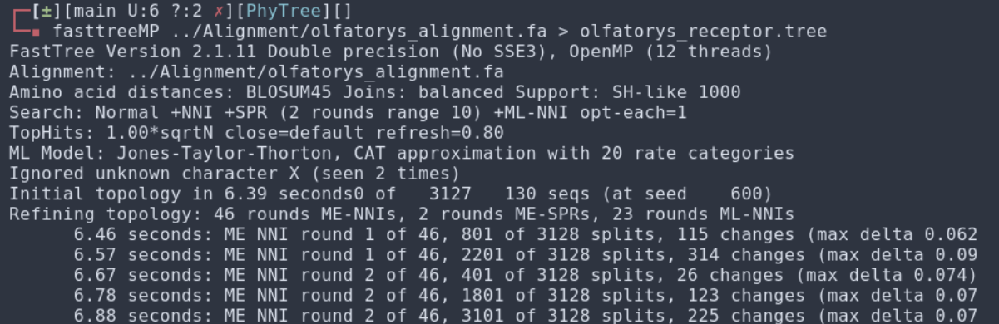

# PhyTree
## Metodología
Con el [alineamiento](https://github.com/justog220/ABP-EB/tree/main/OlfatoryReceptors/Alignment) producido previamente llevamos a cabo la construcción de un arbol filogenético. Para ello debimos instalar [FastTree](http://www.microbesonline.org/fasttree/). Con esta herramienta ya correctamente descargada, la utilizamos con sus parámetros por defecto para su ejecución.  

La ejecución del comando de la figura anterior, da como resultado un archivo *olfatorys_receptor.tree* con la información en formato de texto del árbol construido. 

Luego, utilizamos visualizadores de árboles para graficarlo, por ejemplo: [Interactive Tree of Life (iTOL)](https://itol.embl.de/tree/14320218109232001715008023#). Esto nos dio como resultados otra vez gráficas cuya interpretación representaba un gran desafio dada la cantidad de proteínas que estabamos alineando.

Llegado este punto, decidimos realizar una búsqueda bibliográfica para llevar a cabo una reducción de la dimensionalidad del problema. De ella emerge Treemmer, módulo clonado en [/Treemmer](https://github.com/justog220/ABP-EB/tree/main/OlfatoryReceptors/Treemmer), allí se puede observar el README, con detalles de como usarlo y las citas.

Discutiendo con Pablo Schierloh, docente a cargo de la materia para la cuál se realizó este trabajo, decidimos delimitar el problema a 5 receptores. Este número nos permitiría trabajar dentro de los tiempos de la materia y aprender y desarrollar proceso que nos permita luego generalizarlo al número que queramos.

Utilizando esta herramienta, obtuvimos la lista en el archivo *[../ReceptoresFiltrados/olfatorys_receptor.tree_trimmed_list_X_5](https://github.com/justog220/ABP-EB/blob/main/OlfatoryReceptors/ReceptoresFiltrados/olfatorys_receptor.tree_trimmed_list_X_5)*.