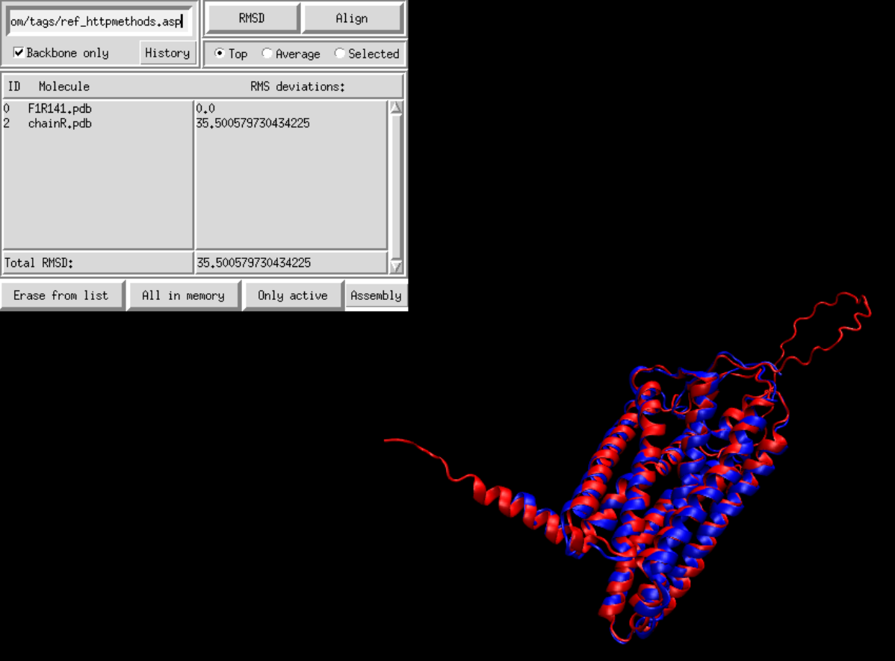
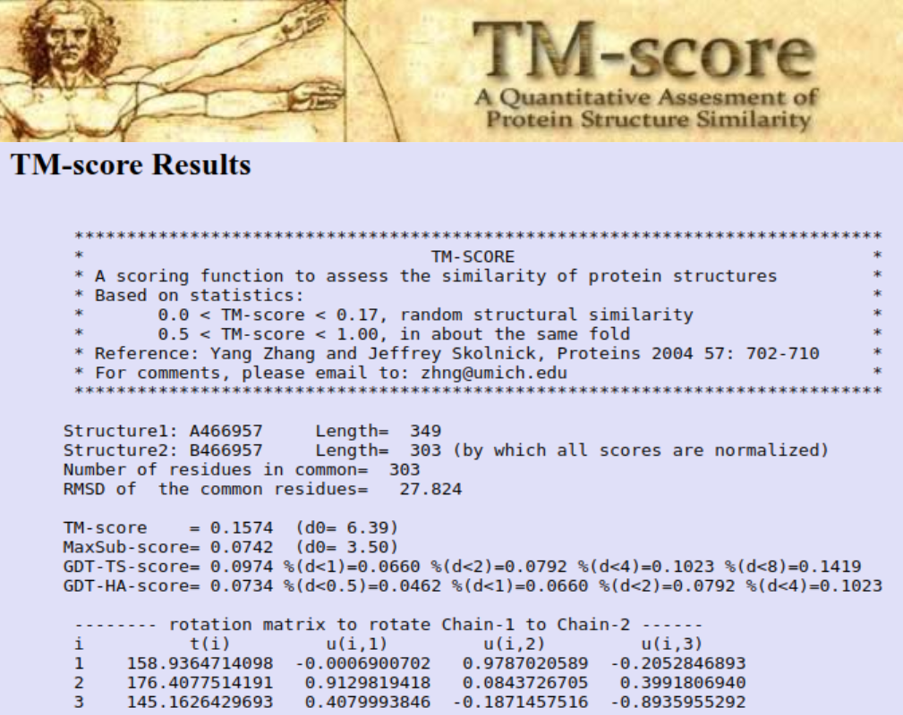
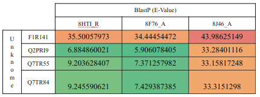
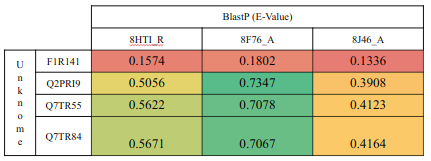

# Receptores Filtrados

## Metodología
Teniendo la lista generada a partir de Treemmer, generamos el un csv con estos receptores. Con este csv pasamos a descargar estructuras generadas por [AlphaFold](https://alphafold.ebi.ac.uk/). Lo hicimos a través de scripts, por lo que de necesitarse realizar con otros procesos podemos utilizar los procesos ya generados.

Habiendo corrido el script para descargar se generan los archivos PDB en el directorio *Estructuras/*.

Llegado a este punto, vimos que uno de los 5 receptores no tenía estructura predicha. Por ello, se redujo a 4:
- F1R141
- Q2PRI9
- Q7TR55
- Q7TR84

A cada uno de ellos los introdujimos para un [BlastP](https://blast.ncbi.nlm.nih.gov/Blast.cgi), observamos que los tres con menor *e-value* eran los mismos para todos. 

|Receptor|Ligando|Olor|Especie|
|:---:|:---:|:---:|:---:|
|8HTI|Ácido octanoico|Rancio, quemado, grasiento|Homo Sapiens|
|8F76|Ácido propanoico|Acre|Homo Sapiens|
|8J46|Apo State|-|Homo Sapiens|

Decidimos bajar estas tres estructuras obtenidas experimentalmente, quedarnos con la cadena correcta y calcular los RMSD y TM-score.

Para el cálculo de RMSD, realizamos un alineamiento estructural con [VMD](https://www.ks.uiuc.edu/Research/vmd/):

Para el [TM-Score](https://zhanggroup.org/TM-score/) usamos la herrramienta disponible como servicio web:

RMSD:

TM-Score:

