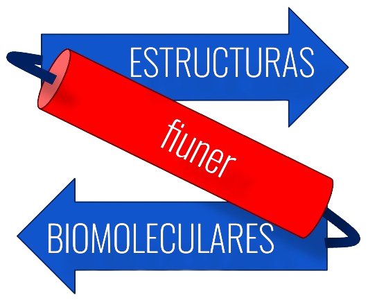

# ABP Estructuras Biomoleculares 
## Garcia - Giorgio
 

### Estructura de directorios
- /Corr: Análisis de correlaciones de parámetros
- /DB: Base de datos del proyecto
- /Docking: Desarrollo de scripts para AutoDocking de receptores olfatorios y ligandos.
- /Exploracion: Análisis exploratorio de la base de datos
	- /PFAM: Análisis de familias de proteínas presentes en la base de datos.
- /imgs: Imágenes utilizadas en READMES
- /OlfatoryReceptors: Carpeta con análisis correspondientes a la familia de receptores olfatorios.
	- /Alignment: Alineamiento de las secuencias de receptores olfatorios.
	- /data: Subset de proteínas de receptores olfatorios.
	- /PhyTree: Creación de árbol filogenético.
	- /Preparation: Obtención de subsets de proteínas de receptores olfatorios.
	- /ReceptoresFiltrados: Reducción de dimensionalidad del árbol filogenético, con la obtención del subset y descarga de las estructuras PDB correspondientes.
		- /Estructuras: Estructuras del PDB.
	- /Treemmer: Módulo utilizado para reducir la dimensionalidad del árbol.

### Objetivo

### Links de interés
- [Unknome](https://unknome.mrc-lmb.cam.ac.uk/)
- [Bitácora](https://docs.google.com/document/d/1hfnAr0R3DH2llRegLN6dVXDsyPDdvUwWzP8I5dPmboY/edit?usp=sharing)
- [Informe](https://docs.google.com/document/d/1W4E4xc-yobJKqFuypAWl4mKD40Bq83cPE_Dq3pm-OxU/edit?usp=sharing)

### Contacto
- Alumnos a cargo del proyecto
	- justo.garcia@ingenieria.uner.edu.ar
	- giovani.giorgio@ingenieria.uner.edu.ar
- Docente a cargo de la materia
	- pablo.schierloh@uner.edu.ar

### Referencias
- Rocha, J. J., Jayaram, S. A., Stevens, T. J., Muschalik, N., Shah, R. D., Emran, S., Robles, C., Freeman, M., & Munro, S. (2023). Functional unknomics: Systematic screening of conserved genes of unknown function. PLOS Biology, 21(8), e3002222. https://doi.org/10.1371/journal.pbio.3002222

- Menardo, F., Loiseau, C., Brites, D., Coscolla, M., Gygli, S. M., Rutaihwa, L. K., Trauner, A., Beisel, C., Borrell, S., & Gagneux, S. (2018). Treemmer: A tool to reduce large phylogenetic datasets with minimal loss of diversity. BMC Bioinformatics, 19(1), 164. https://doi.org/10.1186/s12859-018-2164-8
